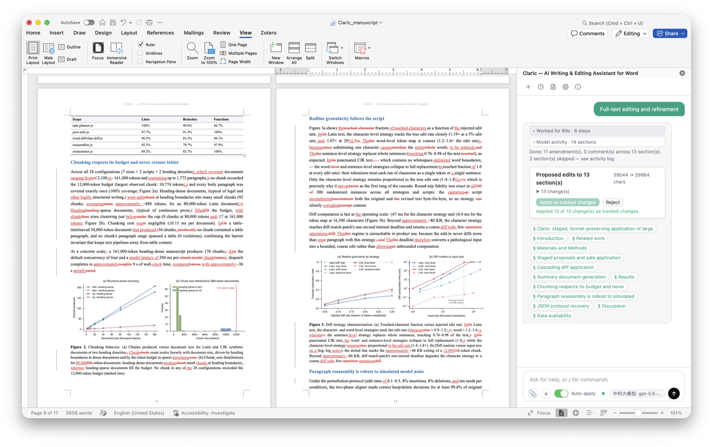

# Claric — AI editing you can review, inside Microsoft Word

<p align="center">
  
</p>

<p align="center">
  <a href="https://scilence2022.github.io/Claric/"><strong>Website (English / 中文)</strong></a> ·
  <a href="https://scilence2022.github.io/Claric/?lang=zh">中文介绍与安装入口</a> ·
  <a href="https://scilence2022.github.io/Claric/architecture.html">Architecture</a> ·
  <a href="https://scilence2022.github.io/Claric/privacy.html">Privacy</a> ·
  <a href="https://github.com/Scilence2022/Claric/issues">Support</a>
</p>

Claric is an open-source Word add-in for revising documents with AI. Ask in
English or Chinese to polish a paragraph, review a contract, edit a table,
or add an illustration. Editing proposals appear in the taskpane for review;
you choose which changes to apply, then review supported text edits as native
Word tracked changes.

Use your own cloud model account or a local backend. Claric does not include
model credits. Keep a document copy and verify the result, especially for
complex formatting, tables, and images: revision support varies by Word host
and operation.

## Screenshots



[See the proposal, table, and illustration gallery](https://scilence2022.github.io/Claric/#gallery).

**Start here:** [Quick start](#quick-start) · [First workflow](#first-workflow) ·
[Models, privacy & safety](#models-privacy--safety) · [Features](#features) ·
[Self-hosting](#setup) · [Troubleshooting](#troubleshooting) · [Development](#option-b-npm-for-development)

## Quick start

### Before you install

- Use **Microsoft Word desktop on macOS or Windows** for this installation
  route. Word version, available Word APIs, and organization policy affect
  what works. Web and mobile hosts do not have equivalent structural-revision
  support and are not the target of these desktop installers.
- Your organization must allow Office add-ins, developer sideloading, and the
  relevant network endpoints. A per-user installer does not override managed
  policies. Consult your administrator if installation or scripts are blocked.
- Have a model endpoint, model name, and API key where required. Cloud API
  usage may be billed separately. Local Ollama/vLLM users should start with
  the [local-server route](#deployment-routes-static-vs-local-server).
- The hosted add-in needs internet access and an endpoint that permits
  browser requests from the add-in's origin (**CORS**). A listed preset is
  not a guarantee of access for every model, account, region, or Word WebView.
  OpenAI's default proxy and local-model proxy paths are not served by GitHub
  Pages; use a trusted HTTPS relay or self-host Claric for those routes.

### Install the hosted version

The scripts sideload the hosted build from
[`scilence2022.github.io/claric-addin`](https://scilence2022.github.io/claric-addin/).
This is separate from the introduction website and is **not a Microsoft Store
installation**. No Node.js or Docker is needed for this route.

**Download the script, open it in a text editor, review it, and only then run
it.** The links below point to the current `main` branch; organizations can
review and pin a specific revision instead. The scripts download a manifest
and, when not bundled locally, a launch-document template. Review those
sources too. Do not bypass your organization's script restrictions.

| Platform | Review source | Installation, options & removal |
|----------|---------------|---------------------------------|
| macOS | [Install-Claric.sh](installer/macos/Install-Claric.sh) | [macOS installer guide](installer/macos/README.md) |
| Windows | [Install-Claric.ps1](installer/windows/Install-Claric.ps1) | [Windows installer guide](installer/windows/README.md) |

**macOS: download in Terminal**

```bash
curl -fL https://raw.githubusercontent.com/Scilence2022/Claric/main/installer/macos/Install-Claric.sh -o Install-Claric.sh
```

After reviewing the downloaded file, run it separately:

```bash
bash ./Install-Claric.sh
```

**Windows: download in PowerShell**

```powershell
Invoke-WebRequest -Uri https://raw.githubusercontent.com/Scilence2022/Claric/main/installer/windows/Install-Claric.ps1 -OutFile Install-Claric.ps1
```

After reviewing the downloaded file, run it separately:

```powershell
.\Install-Claric.ps1
```

The installer registers Claric for the current user and opens
`Claric-Launch.docx` in Word. On macOS it uses Word's `wef` folder; on Windows
it writes a per-user Office developer-add-in registry entry. Neither script
normally needs administrator privileges. If the pane does not appear, fully
quit Word and reopen the launch document:

- macOS: `~/Library/Application Support/ClaricAddin/Claric-Launch.docx`
- Windows: `%LOCALAPPDATA%\ClaricAddin\Claric-Launch.docx`

The installers register a hosted add-in, not an offline copy. Future hosted
updates can change the taskpane without reinstalling. See the platform guides
for uninstall scripts, or [manual sideloading](#sideload-the-add-in) for a
self-hosted manifest. Prefer the download-review-run procedure above even
where older installer examples show a download-and-execute one-liner.

### Connect your model

Open **Settings → General**, choose a chat provider, confirm the endpoint and
model, and enter your own API key if needed. Keep **Enable Track Changes**
checked, then click **Save**. Saving automatically checks the chat connection;
watch the connection status under **LLM Backend**. **Refresh** beside the
**Model** field updates the model list. Leave **Auto-apply** off in the
composer for your first run.

A failed connection may mean an invalid key or model, quota limits, an
unreachable endpoint, or CORS restrictions. Check the
[route comparison](#deployment-routes-static-vs-local-server) before changing
providers. **Image Generation** has separate provider, model, and key settings;
its **Test image connection** button makes a real image-generation request
and may incur a charge.

## First workflow

1. **Start with a copy of a non-sensitive document.** Select one paragraph in
   Word, then ask: `Polish this paragraph for clarity without changing its meaning.`
   Chinese instructions work too, for example: `润色这段文字，保留原意。`
2. **Review the proposal.** Compare the before/after diff, locate the source
   text, and uncheck changes you do not want. **Reject** discards a pending
   proposal; it does not undo edits already written to Word.
3. **Apply the checked changes.** With Auto-apply off, proposals wait for
   your approval. For the text edit, click **Apply as tracked changes**.
   Inspect the result in Word's **Review** tab and accept or reject the
   supported tracked revisions there.
4. **Expand the scope when ready.** Clear the selection and ask to polish the
   document, use `/check-doc`, or request a table or illustration. Check the
   proposal's scope and warnings before applying: some operations affect the
   whole document or create a new document.

Failed whole-document sections can be retried without rerunning successful
sections. Retry results are staged as a **new proposal** for review, rather
than silently applied by the retry action. Check partial-application warnings
in Word before retrying an operation that may already have written content.

Auto-apply is an explicit, persistent opt-in for eligible pending proposals.
It runs after a successful turn settles, requires Track Changes to be enabled,
and skips invalidated sessions or non-pending cards. Turning it on removes
the manual approval pause; it does not make every operation reversible or
guarantee structural tracked changes. Keep it off when you need to approve
each proposal before any application.

## Models, Privacy & Safety

**Chat presets:** Ollama, vLLM, OpenAI, Claude (Anthropic), DeepSeek, Zhipu GLM,
Moonshot Kimi, MiniMax (international), MiniMax China, 中科大模型 (zhongkeyu.com),
OpenRouter, SiliconFlow, and Custom (OpenAI-compatible).

**Image presets:** OpenAI Images, Zhipu CogView, MiniMax Images, 中科云 Images
(zhongkeyu.com), OpenRouter Images, SiliconFlow Images, and Custom
(OpenAI-compatible). Chat and image
configuration are independent. An API-compatible endpoint must also support
the selected model and request format; not every model offered by a gateway
supports every Claric operation. Current defaults live in
[chat presets](src/lib/providers.js) and [image presets](src/lib/image-providers.js).

- **What is sent:** instructions and document context required by the chosen
  operation go to configured model endpoints. That context can include selected
  text, whole-document content, comments, tracked changes, or images. Review
  scope before sending confidential material.
- **Where keys live:** provider keys are stored in plaintext in the add-in's
  browser `localStorage`, scoped to its serving origin. Keys are transmitted to
  configured endpoints and through any configured proxy or relay. Use trusted
  hosts, restricted keys, and appropriate provider retention policies.
- **Local does not automatically mean offline:** a local chat backend can keep
  its model processing local, but the hosted UI, cloud image providers, or MCP
  servers can still involve external services. Verify every enabled route.
- **External tools can have side effects:** MCP tools do not directly edit the
  Word document through Claric's document-edit path, but their servers may
  modify external systems. Only enable servers and tools you trust; Word
  proposal review is not an approval boundary for external tool effects.
- **Review remains necessary:** AI output can be wrong, omit material, or change
  meaning. Formatting preservation and tracked revisions are best-effort and
  host-dependent. Keep backups and inspect text, tables, images, and comments.

Read the [privacy policy](https://scilence2022.github.io/Claric/privacy.html)
and [security notes](#security-notes) before using sensitive documents.

## Features

Choose a workflow, then expand its details. For examples, see the website's
[features](https://scilence2022.github.io/Claric/#features) and
[scenarios](https://scilence2022.github.io/Claric/#scenarios).

<details>
<summary>Editing, proposals, and whole-document review</summary>

### Chat Interface & Turn Routing

Ask in English or Chinese to edit, format, append, create tables or
illustrations, clean up empty paragraphs, or answer questions. A text
selection usually focuses editing on that selection; document-scope skills
and object operations can have a broader scope. Compound requests can be
split into ordered tasks with separate proposals. Cancel stops ongoing
processing; inspect any writes that already completed.

Built-in skills include `/copy-edit`, `/check-doc`, `/flag-issues`,
`/summarize-contract`, `/industry-overview`, and `/storylining`.

### Staged Proposals & Per-Change Review

Proposals provide a diff preview, per-change selection, and source-location
controls where supported. Apply writes the checked changes; Reject discards
the pending proposal. Skipped sections and no-change results are reported.
Ranges are checked again at application time to reduce stale-target risks;
review warnings if the document changed after staging. See
[First workflow](#first-workflow) for the persistent Auto-apply option.

### AI Redlining

Text editing supports word-level tracked changes and a CJK character-level
diff strategy. The diff layer attempts to preserve run formatting and can
fall back to sentence or block replacement. Check the resulting formatting
and revision marks in Word, particularly in complex documents.

### Whole-Document Processing

Heading-aware, token-bounded chunks keep tables together and share nearby
context. Parallel processing provides progress, cancellation, and failed-section
retry. Reassembly aligns paragraphs and attempts to retain styles, numbering,
and indentation. Combined amendment-and-comment runs can add comments along
with text edits. Successful retry results return as new reviewable proposals.

### Document Summary & Comments

`/summarize-contract` can use document text, comments, and tracked changes to
create a formatted summary in a **new Word document**, including an annex of
source comments. Prompts support `{comments}`, `{whole document}`, and
`{tracked changes}`. Document extraction can be plain, heading-aware, or
structured with lists. Comment operations depend on available Word APIs;
check pending-comment and failure notices.

### Model Activity, Work Log & Streaming

A per-turn work log shows progress and model activity. Answers and editing
runs support streamed output with fallback when streaming is unavailable.
Selection context and proposal scope help you check what a run is acting on.

</details>

<details>
<summary>Formatting, tables, illustrations, and document cleanup</summary>

### Formatting & Insert Ops

Ask to change a heading style, font, alignment, spacing, or indentation, or to
insert a short structural element such as a title. Formatting requests use
an allowed set of operations rather than arbitrary code. Formatting-only
operations target properties; insert operations add content. Revision
visibility depends on the operation and Word host.

### Illustration Pipeline

Generate an illustration with the independently configured image provider,
review its preview, then insert it. Explicit vector requests use a chat-model
SVG path; this also serves as a fallback when image generation is disabled or
fails. SVG is sanitized and converted to PNG for Word insertion. Image API
responses and hosted image downloads must both be reachable from your route.

### Document Append

Ask to continue writing using document context. New text is staged as an
append-to-end proposal before application.

### Table Creation

Ask for an empty grid (`Insert a 3x3 table at the end of the document`) or a
table with generated content. Empty grids with explicit dimensions do not
need an LLM call. Generated grids are validated and previewed before insertion
as native Word tables. Desktop hosts can record table insertion as a revision;
hosts without structural-revision support receive an explicit warning and
may insert it untracked.

Existing table selections have their own editing path for cell changes and
row operations. Table and image tool sessions stage operations such as table
merges, image resizing, alignment, replacement, deletion, and alt text. Review
the proposed transaction and its tracking limitations before application.

### Empty-Paragraph Cleanup

A deterministic scan proposes removal of empty paragraphs without an LLM
request. It excludes the final paragraph, table-cell paragraphs, and
paragraphs containing inline pictures. Application reports the removal count.

</details>

<details>
<summary>Skills, prompts, model configuration, and external tools</summary>

### MCP Tools (Model Context Protocol)

Configure HTTP Streamable MCP servers in **Settings → MCP Servers**, then use
`/mcp <instruction>` to call enabled tools. Servers can supply resources and
prompt templates; tool output appears in the work log. Tool permissions and
external side effects belong to the connected server, not Word's proposal
review system. CORS-restricted servers may need a trusted same-origin proxy
using `CUSTOM_PROXY_PATH` and `CUSTOM_PROXY_TARGET`.

### Skill Packages (SKILL.md)

Import Markdown skill packages with YAML frontmatter in **Settings → Skills**.
Imported packages become slash commands, persist in localStorage, and can be
removed in Settings. Review imported instructions before using them.

### Prompt System

Manage context, amendment, comment, and summary prompts with placeholders
such as `{selection}`. Saved prompts persist locally and can be used as
custom slash commands.

### LLM Backends

See the [model list and data-flow notes](#models-privacy--safety). Most chat
presets use an OpenAI-compatible API; Claude uses Anthropic's Messages API.
Model suggestions can be refreshed, and endpoints and model names can be
edited. Thinking and temperature controls vary by model capability. Preset
availability does not establish live provider compatibility; test your setup.

### Settings & UX

Settings include model connections, prompts, extraction, Track Changes, and
diff preferences. Configuration persists in localStorage. Switching hosting
origins starts with separate settings. The activity log and connection or
pending-comment indicators expose progress and failures.

</details>

## Setup

The [hosted installer](#quick-start) is the shortest path for desktop users
with a browser-accessible cloud model. Self-host if you need local-model
proxies, control over the served build, or development tools:

| Method | Best for | Requirements |
|--------|----------|--------------|
| [Docker](#option-a-docker-recommended-for-quick-setup) | Self-hosting without local Node.js | Docker, Docker Compose, trusted HTTPS |
| [npm](#option-b-npm-for-development) | Development and customization | Node.js 22+, trusted HTTPS |

Both self-hosted methods require a reachable server and certificates trusted
by the machine running Word. Production proxy routes must be enabled explicitly.

## Deployment Routes: Static vs Local Server

| | Hosted static build | Local or self-hosted server |
|---|---|---|
| Taskpane origin | `https://scilence2022.github.io/claric-addin/` | `https://localhost:<PORT>` or your HTTPS host |
| Cloud chat | Direct requests only where the endpoint permits the add-in origin and request headers | Same-origin proxy paths when configured |
| OpenAI | The preset expects `/openai`, which Pages does not provide; use a trusted HTTPS, CORS-enabled compatible relay | Enable `/openai` and its upstream |
| Ollama / vLLM | No built-in proxy; direct local HTTP access is not portable across Word WebViews due to mixed-content and local-network restrictions | Enable `/ollama` or `/vllm` and run the upstream |
| Image generation | Both the generation endpoint and any returned image URL must be accessible; OpenAI Images needs a relay | Enable the relevant provider proxy; separately check returned image URLs |
| Backend server | None for compatible direct endpoints | Docker or npm server plus model upstreams |
| Typical use | Hosted installation with a compatible cloud endpoint | Local AI, managed deployment, development |

Current presets choose absolute cloud API URLs on GitHub Pages and same-origin
proxy paths on other hosts, with exceptions such as OpenAI and local models.
This origin detection is not universal static-host detection: on another
static domain, check and set absolute endpoint URLs explicitly. CORS policy,
authentication, endpoint format, region, and WebView behavior still determine
whether requests work. Production is **not zero-configuration**.

### Switching routes

| Command | Effect |
|---------|--------|
| `npm run manifest:local` | Update `.env` (`HOST=localhost`, `HOST_PORT=3001`) and regenerate `manifest.xml` for the local server |
| `npm run manifest:store` | Regenerate it for the hosted Pages build (`HOST=scilence2022.github.io`, base path `/claric-addin`); the command name does not imply a Store listing |
| `npm run sideload` | Register the current manifest in macOS's `wef` folder or Windows's developer-add-in registry |
| `npm run sideload:remove` | Remove the sideloaded registration on the current desktop platform |
| `npm run publish:addin` | Maintainer operation: build, switch manifest, and push artifacts to `Scilence2022/claric-addin` |

For a local session, configure the environment and certificates, run
`npm run manifest:local`, start `npm start` (or `docker compose up -d`), then
run `npm run sideload` and restart Word. Verify your port after switching
manifest modes. Publishing changes the remote hosted build and requires the
appropriate repository permissions; it is not part of installation.

### Route-specific notes

- **Settings are per-origin.** Provider choices and keys stored at
  `https://localhost:3001` are separate from those at
  `https://scilence2022.github.io`. Reconfigure after switching routes.
- **Static installs and local models.** Use the local-server route, or a
  reachable HTTPS relay whose CORS policy permits the taskpane origin.
  For direct Ollama access, configure `OLLAMA_ORIGINS` as needed. Do not expose
  an unauthenticated model service publicly to bypass browser restrictions.
- **Provider policies can change.** A same-origin proxy avoids browser CORS
  on the upstream request, but still needs a valid endpoint, credentials,
  network access, and production route configuration. Relays handle request
  content and keys; choose and secure them accordingly.
- **Manifest `BASE_PATH`.** Defaults to `/claric-addin` when
  `HOST=scilence2022.github.io`, and empty for other hosts. Override it when
  publishing under a different repository path.

## Option A: Docker (Recommended for Quick Setup)

This is the quick **self-hosting** option, not a requirement for hosted use.

### Prerequisites

- Docker and Docker Compose
- [Trusted HTTPS certificate files](#create-https-certificates)
- A reachable model service or cloud endpoint and credentials as required

### Step-by-Step

1. Clone the repository:

   ```bash
   git clone https://github.com/Scilence2022/Claric.git
   cd Claric
   ```

2. [Create certificates](#create-https-certificates) and place `server.pem`
   and `server-key.pem` in the project root.
3. Copy the example, then edit `.env`:

   ```bash
   cp .env.docker.example .env
   ```

   Windows PowerShell:

   ```powershell
   Copy-Item .env.docker.example .env
   ```

   Set `HOST` to a hostname or IP reachable from Word; use `localhost` only
   when Word runs on the same machine. Set `HOST_PORT` and explicitly enable
   the required `*_PROXY_PATH` routes. Confirm their `*_PROXY_TARGET` values.

4. Start the container:

   ```bash
   docker compose up -d
   ```

   The container serves `dist/` over HTTPS as a non-root user and regenerates
   the manifest at startup. Pin `ADDIN_GUID` in `.env` to retain the same
   add-in identity across container recreation.

5. Download `https://<HOST>:<HOST_PORT>/manifest.xml` in a browser.
6. Trust the certificate on the Word client, then
   [sideload the manifest](#sideload-the-add-in).
7. [Configure and save the model settings](#connect-your-model), then check
   the connection status. For local models, the Docker example targets
   `host.docker.internal:11434` (Ollama) and `:8026` (vLLM); those services
   must actually be running and reachable.

## Option B: npm (For Development)

### Prerequisites

- Node.js 22+ (see [.nvmrc](.nvmrc) and [package.json](package.json))
- [Trusted HTTPS certificate files](#create-https-certificates)

### Step-by-Step

1. Clone and install dependencies:

   ```bash
   git clone https://github.com/Scilence2022/Claric.git
   cd Claric
   npm install
   ```

2. Create `server.pem` and `server-key.pem` in the project root.
3. Copy the environment example and edit it:

   ```bash
   cp .env.example .env
   ```

   Windows PowerShell:

   ```powershell
   Copy-Item .env.example .env
   ```

   Set `HOST` to a hostname reachable from Word and keep manifest and dev
   server ports aligned. A different Word machine cannot use your `localhost`.

4. Start the development server:

   ```bash
   npm start
   ```

   This generates `manifest.xml` from the environment and starts webpack
   with hot reload.
5. Trust the certificate and [sideload](#sideload-the-add-in) the root
   `manifest.xml`. [Configure and save the model settings](#connect-your-model),
   then check the connection status.

## Create HTTPS Certificates

Self-hosted add-ins need HTTPS trusted by the Word client. The public hosted
build already uses HTTPS; its installer does not require a local certificate.
Never accept an unexpected certificate warning without verifying its source.

Place these files in the project root and keep private keys out of version control:

- `server.pem`: certificate
- `server-key.pem`: private key

### Option 1: mkcert (Recommended)

Install [mkcert](https://github.com/FiloSottile/mkcert), then create a local
certificate authority and a certificate for the exact hostname Word uses:

```bash
mkcert -install
mkcert -cert-file server.pem -key-file server-key.pem localhost
```

For a remote server, replace `localhost` with its real hostname or IP. To use
mkcert's default output names instead:

```bash
mkcert localhost
cp localhost.pem server.pem
cp localhost-key.pem server-key.pem
```

Windows PowerShell copies:

```powershell
Copy-Item localhost.pem server.pem
Copy-Item localhost-key.pem server-key.pem
```

`mkcert -install` changes local trust and may require elevated approval. On a
different client machine, trust the verified CA certificate according to your
organization's policy. On macOS, use Keychain Access for a manually supplied
CA; verify it before adjusting trust. Do not copy or share `rootCA-key.pem`.

### Option 2: OpenSSL (Manual)

Use an OpenSSL version supporting `-addext`. Replace `YOUR_HOST` with the
actual DNS name. For an IP address use `subjectAltName=IP:YOUR_IP` instead:

```bash
openssl req -x509 -nodes -days 365 \
  -newkey rsa:2048 \
  -keyout server-key.pem \
  -out server.pem \
  -subj "/CN=YOUR_HOST" \
  -addext "subjectAltName=DNS:YOUR_HOST"
```

The subject alternative name (SAN) must match the hostname Word connects to;
a common name alone is insufficient. Trust the resulting certificate on the
Word client. Prefer mkcert if the system OpenSSL does not support this option.

## Trust the Certificate on Windows

On the Windows PC running Word:

1. Copy only the verified public certificate to the PC, never its private key.
2. Convert PEM to CRT if needed:

   ```powershell
   openssl x509 -in server.pem -out server.crt
   ```

3. Open `certmgr.msc` for the current user's certificate store.
4. Under **Trusted Root Certification Authorities → Certificates**, choose
   **All Tasks → Import**, select the certificate, and finish the wizard.
   Organization policy may restrict this; machine-wide trust changes require
   administrator approval.

With mkcert, import the CA's **`rootCA.pem`** instead (locate it on the server
with `mkcert -CAROOT`). Verify its identity first. Never transfer
`rootCA-key.pem`. Restart Word after changing trust.

## Sideload the Add-in

Hosted users can use [Quick start](#quick-start). The following alternatives
support self-hosting and manual registration. Office policy can restrict any
of these methods; menu labels also vary by Word version.

### Word on Windows

**Method 1: Per-user installer**

For hosted use, [download and review the Windows script](#install-the-hosted-version)
before running it. For a self-hosted checkout, generate the manifest for your
server and run:

```bash
npm run install:windows
```

Or invoke the reviewed script directly in PowerShell:

```powershell
.\installer\windows\Install-Claric.ps1 -ManifestPath .\manifest.xml
```

The script copies the manifest to `%LOCALAPPDATA%\ClaricAddin\`, registers it
under `HKCU\SOFTWARE\Microsoft\Office\16.0\Wef\Developer`, and creates
`Claric-Launch.docx`. The npm wrapper registers without launching Word; open
the launch document yourself. Claric may also appear under
**Insert → Get Add-ins → My Add-ins**. Remove it with the reviewed
[Uninstall-Claric.ps1](installer/windows/Uninstall-Claric.ps1) or
`npm run uninstall:windows`. See the [Windows guide](installer/windows/README.md).

**Method 2: Add from file**, if your Word build offers it:

1. Open **Insert → Get Add-ins → My Add-ins**.
2. Choose **Add a custom add-in → Add from file**.
3. Select `manifest.xml` and confirm.

**Method 3: Network shared folder**:

1. Create a real UNC share; a plain `C:\...` path is not a shared catalog.
2. Open **File → Options → Trust Center → Trust Center Settings → Trusted
   Add-in Catalogs**, add the catalog, and select **Show in Menu**.
3. Copy the manifest to the share.
4. Open **Home → Add-ins → Advanced → Shared Folder** and add Claric.

See [Microsoft's shared-folder guide](https://learn.microsoft.com/en-us/office/dev/add-ins/testing/create-a-network-shared-folder-catalog-for-task-pane-and-content-add-ins).

### Word on Mac

**Method 1: Per-user installer**

For hosted use, [download and review the macOS script](#install-the-hosted-version)
before running it. For a self-hosted checkout, generate the manifest for your
server and run:

```bash
npm run install:macos
```

Or invoke the reviewed script directly:

```bash
bash installer/macos/Install-Claric.sh --manifest manifest.xml
```

The script copies the manifest into Word's `wef` folder and creates
`~/Library/Application Support/ClaricAddin/Claric-Launch.docx`. The npm wrapper
registers without launching Word; open the launch document yourself, or look
under **Home → Add-ins → Claric**. Remove it with the reviewed
[Uninstall-Claric.sh](installer/macos/Uninstall-Claric.sh) or
`npm run uninstall:macos`. See the [macOS guide](installer/macos/README.md).

**Method 2: Manual wef-folder sideload**

1. Start your HTTPS server and verify it is reachable.
2. In Finder, use **Cmd+Shift+G** to open
   `~/Library/Containers/com.microsoft.Word/Data/Documents/wef`; create `wef`
   if needed.
3. Copy `manifest.xml` there. For Docker, download it from
   `https://<HOST>:<HOST_PORT>/manifest.xml`.
4. Fully quit Word (**Cmd+Q**) and reopen it; then look under
   **Home → Add-ins → Claric**.
5. If your verified self-hosted certificate is not trusted, configure trust
   in Keychain Access before reopening the pane.

See [Microsoft's Mac sideloading guide](https://learn.microsoft.com/en-us/office/dev/add-ins/testing/sideload-an-office-add-in-on-mac).

## Troubleshooting

| Problem | Checks and next step |
|---------|----------------------|
| Hosted launch document opens without the pane | Fully quit Word and reopen it; check sideloading policy and the platform installer guide |
| PowerShell blocks the installer | Review the downloaded script and consult your administrator or approved local policy; do not bypass managed restrictions |
| Word reports a certificate or signing warning | Verify the warning's source; for self-hosted HTTPS, check certificate trust and hostname. Trust changes do not fix organization add-in restrictions |
| Word cannot load a self-hosted add-in | Check `HOST`, port, server availability, client reachability, and HTTPS trust |
| Manifest not generated | Create `.env` before `npm start`; for Docker, fetch `https://<HOST>:<HOST_PORT>/manifest.xml` |
| Firewall blocks access | Allow only the required inbound TCP port (`HOST_PORT` for Docker) from the intended clients |
| Model connection fails | Check endpoint, model access, key, quota, network, and CORS. The hosted UI has no same-origin model proxy |
| Local model fails in Docker | Check the upstream is running and reachable via `host.docker.internal`; verify `OLLAMA_PROXY_TARGET` or `VLLM_PROXY_TARGET` |
| Production proxy route missing | Routes are disabled unless their `*_PROXY_PATH` is set; configure the target too if it differs from the default |
| Changed `.env` is ignored after `docker compose restart` | Recreate the container with `docker compose down && docker compose up -d`; restart alone keeps the original env-file resolution |
| HTTPS reports "wrong version number" or no response | Check for another process on that host port; choose a free `HOST_PORT` and recreate the container |
| Certificate hostname mismatch | Regenerate the certificate with a SAN covering the exact hostname or IP Word uses |
| Docker build fails at `npm ci` | Inspect the error, registry connectivity, and lockfile consistency; retry transient failures before considering a no-cache build |
| Hosted Ollama/vLLM cannot connect | Use a local server with configured proxies, or a trusted HTTPS relay with appropriate CORS and access controls |
| Image generation succeeds but preview fails | Check the returned image URL's accessibility and CORS separately from the generation endpoint |
| Retry or Apply reports a partial result | Inspect the document and warnings first; retrying failed processing creates a new proposal, while partial writes may already be present |
| Hosted add-in still shows old behavior | Allow for Pages/WebView caches, fully quit and reopen Word, then consult the platform guide before clearing Office caches |

### Deployment footnotes

- **Environment changes need recreation.** `docker compose down && docker
  compose up -d` reloads `.env` and briefly stops the service. It does not
  rebuild the image.
- **`HOST_PORT` vs `PORT`.** Compose publishes `HOST_PORT`; the container
  listens on `PORT=3000` internally. Avoid collisions with other services.
- **Production proxies are opt-in.** Set each required `*_PROXY_PATH` and,
  when different from its default, `*_PROXY_TARGET`. Recreate the container
  after environment changes.
- **Keys are client-side settings.** Chat and image keys are entered in the
  taskpane and stored in localStorage, not read from `.env` by the proxy.
  The proxy forwards requests containing those credentials.
- **Rebuilds.** Use `docker compose build` after source changes. Use
  `docker compose build --no-cache` when diagnosing stale layers or needing a
  clean dependency/toolchain rebuild; it is not required for `.env` changes.

## Environment Variables

### All deployments

Production model proxy routes in `scripts/docker-server.cjs` are disabled by
default. Set a path to enable each route. The development server enables
provider paths by default; example files may opt into routes explicitly.

| Variable | Default | Description |
|----------|---------|-------------|
| `HOST` | `localhost` | Hostname for manifest URLs, reachable from Word |
| `PORT` | `3000` | Manifest/server port; check mode-specific overrides |
| `PROTOCOL` | `https` | Manifest and server protocol |
| `SSL_CERT_FILE` | `server.pem` | HTTPS certificate path |
| `SSL_KEY_FILE` | `server-key.pem` | HTTPS private-key path |
| `ADDIN_GUID` | generated | Identity persisted in `.manifest-guid`; pin for container recreation |
| `DISPLAY_NAME` | `Claric — AI Writing & Editing Assistant for Word` | Manifest display name |
| `SUPPORT_URL` | add-in root URL | Manifest support page; set a real support URL |
| `APP_DOMAINS` | none | Comma-separated extra manifest domains |
| `OLLAMA_PROXY_PATH` | disabled / `/ollama` (dev) | Enable Ollama proxy |
| `OLLAMA_PROXY_TARGET` | `http://localhost:11434` | Docker example uses `http://host.docker.internal:11434` |
| `VLLM_PROXY_PATH` | disabled / `/vllm` (dev) | Enable vLLM proxy |
| `VLLM_PROXY_TARGET` | `http://localhost:8026` | Docker example uses `http://host.docker.internal:8026` |
| `OPENAI_PROXY_PATH` | disabled / `/openai` (dev) | Enable OpenAI proxy; hosted Pages has no such route |
| `OPENAI_PROXY_TARGET` | `https://api.openai.com` | OpenAI upstream |
| `CLAUDE_PROXY_PATH` | disabled / `/claude` (dev) | Enable Anthropic proxy |
| `CLAUDE_PROXY_TARGET` | `https://api.anthropic.com` | Anthropic upstream |
| `DEEPSEEK_PROXY_PATH` | disabled / `/deepseek` (dev) | Enable DeepSeek proxy |
| `DEEPSEEK_PROXY_TARGET` | `https://api.deepseek.com` | DeepSeek upstream |
| `GLM_PROXY_PATH` | disabled / `/glm` (dev) | Enable Zhipu proxy |
| `GLM_PROXY_TARGET` | `https://open.bigmodel.cn` | Zhipu upstream |
| `KIMI_PROXY_PATH` | disabled / `/kimi` (dev) | Enable Moonshot proxy |
| `KIMI_PROXY_TARGET` | `https://api.moonshot.cn` | Moonshot upstream |
| `MINIMAX_PROXY_PATH` | disabled / `/minimax` (dev) | Enable MiniMax international proxy |
| `MINIMAX_PROXY_TARGET` | `https://api.minimax.io` | MiniMax international upstream |
| `MINIMAX_CN_PROXY_PATH` | disabled / `/minimax-cn` (dev) | Enable MiniMax China proxy |
| `MINIMAX_CN_PROXY_TARGET` | `https://api.minimaxi.com` | MiniMax China upstream |
| `ZHONGKEYU_PROXY_PATH` | disabled / `/zhongkeyu` (dev) | Enable 中科大模型 proxy |
| `ZHONGKEYU_PROXY_TARGET` | `https://zhongkeyu.com` | 中科大模型 upstream |
| `OPENROUTER_PROXY_PATH` | disabled / `/openrouter` (dev) | Enable OpenRouter proxy |
| `OPENROUTER_PROXY_TARGET` | `https://openrouter.ai` | OpenRouter upstream |
| `SILICONFLOW_PROXY_PATH` | disabled / `/siliconflow` (dev) | Enable SiliconFlow proxy |
| `SILICONFLOW_PROXY_TARGET` | `https://api.siliconflow.cn` | SiliconFlow upstream |
| `CUSTOM_PROXY_PATH` | empty | Optional custom chat, image, or MCP proxy path |
| `CUSTOM_PROXY_TARGET` | empty | Required together with the custom path |
| `LLM_PROXY_TIMEOUT_MS` | `300000` | Upstream timeout in milliseconds |

### Dev server only (webpack)

| Variable | Default | Description |
|----------|---------|-------------|
| `DEV_SERVER_HOST` | `127.0.0.1` | Bind address; `0.0.0.0` exposes the server to the network |
| `DEV_SERVER_PORT` | `3000` | Webpack server port |
| `ENABLE_DEV_ENDPOINTS` | off | Enable authenticated local harness endpoints; not a real Word end-to-end driver |
| `CLARIC_HARNESS_TOKEN` | generated at setup | Required via `x-claric-harness-token`; treat startup output as secret |
| `CLARIC_HARNESS_ORIGINS` | same origin only | Exact extra HTTP(S) origins; wildcards rejected |
| `LLM_PROXY_TLS_VERIFY` | `true` | Disable only for an explicitly trusted local test backend |
| `OLLAMA_PROXY_PATH` | `/ollama` | Local proxy path |
| `OLLAMA_PROXY_TARGET` | `http://localhost:11434` | Ollama upstream |
| `VLLM_PROXY_PATH` | `/vllm` | Local proxy path |
| `VLLM_PROXY_TARGET` | `http://localhost:8026` | vLLM upstream |
| `DEFAULT_OLLAMA_URL` | `/ollama` | Default UI URL |
| `DEFAULT_VLLM_URL` | `/vllm` | Default UI URL |
| `DEFAULT_MODEL` | `gpt-oss:20b` | Default Ollama model |
| `VLLM_MODEL` | `qwen3.5-35b-a3b` | Default vLLM model |

Users can override URLs and models in Settings; those values persist in
localStorage. See the [development harness protocol](docs/dev-harness-protocol.md)
for authenticated driver setup and migration.

### Docker only (docker-compose)

| Variable | Default | Description |
|----------|---------|-------------|
| `HOST_PORT` | `3000` | Host-side published port and external manifest port |

## Docker Image

Build the production image locally:

```bash
docker build -t claric .
```

The three-stage `node:22-alpine` build includes production dependencies in the
runtime image, runs as the non-root `node` user, and provides `/healthz` for
the Docker health check. Protect exposed proxies with network/access controls;
do not deploy an unrestricted public relay.

## Project Structure

See [ARCHITECTURE.md](ARCHITECTURE.md) for the code layout and pipeline design,
or browse the [architecture page](https://scilence2022.github.io/Claric/architecture.html).

## Testing

From a development checkout:

```bash
npm test                 # Jest suites
npm run lint             # ESLint
npm run coverage         # Jest coverage report
npm run check-coverage   # Enforce coverage thresholds
npm run typecheck        # TypeScript declaration/type checks
npm run build            # Webpack production build
npm run verify-build     # Production artifact fingerprint and metadata
npm run verify           # All of the above in sequence
```

For the independent image-generation path:

```bash
npm test -- --runInBand tests/illustration.spec.js tests/image-client.spec.js tests/image-providers.spec.js
```

The [test suites](tests/) cover prompts and persistence, document extraction,
chunking and reassembly, proposal review, routing, diff strategies, table and
image operations, model clients, and deployment tooling. CI also audits
dependencies and builds/scans the container.

Automated gates do **not** constitute real Word product acceptance. See the
[product acceptance specification](docs/product-acceptance-spec.md) for evidence
layers and the platform matrix, and the
[product readiness analysis](docs/product-readiness-analysis.md) for remaining
risks and release criteria. Exercise representative documents in the actual
Word hosts and model routes you intend to support.

## Acknowledgments

Claric is a fork of **[word-ai-redliner](https://github.com/yuch85/word-ai-redliner)**
by yuch85. Its document pipeline, chunking, and formatting-preserving
reassembly form the foundation of this codebase.

Other projects informed the document-editing approach:

- [docx-redline-js](https://github.com/AnsonLai/docx-redline-js), by Anson Lai:
  OOXML redlining and paragraph/run formatting preservation.
- [safe-docx](https://github.com/usejunior/safe-docx), by UseJunior:
  paragraph cloning, text matching, and run splitting.
- [adeu](https://pypi.org/project/adeu/), by Dealfluence Oy (Mikko Korpela,
  Uzair Ahmed): tracked-change operations and formatting coherence.
- [@xmldom/xmldom](https://github.com/xmldom/xmldom): namespace-aware XML
  manipulation and whitespace handling.

## Security Notes

- **Credential storage:** localStorage is plaintext and is not a secret vault.
  Keys travel with requests to configured endpoints and proxies. Limit key
  scope, review host trust, and rotate credentials if exposed.
- **Document and tool output:** generated summary HTML and SVG pass through
  sanitization. This reduces markup risks; it does not establish factual
  correctness or remove prompt-injection risks from model/tool workflows.
- **Hosting:** use trusted HTTPS, restrict proxy access, and avoid exposing
  development harness endpoints to untrusted networks. Server hardening is
  not a substitute for deployment access controls.
- **External services:** provider and MCP server retention, logging, access
  control, and side effects depend on those services and their configuration.
- Report vulnerabilities according to [SECURITY.md](SECURITY.md).

## Licensing

Claric is licensed under the **[MIT License](LICENSE)**.

Specific code vendored from `office-word-diff` is licensed under
**Apache 2.0**, as detailed in its
[LICENSE](src/lib/word-diff/LICENSE) and [NOTICE](src/lib/word-diff/NOTICE).
These third-party notices do not make the whole project dual-licensed.
The installer template has separate
[third-party notices](installer/windows/templates/THIRD-PARTY-NOTICES.md).
