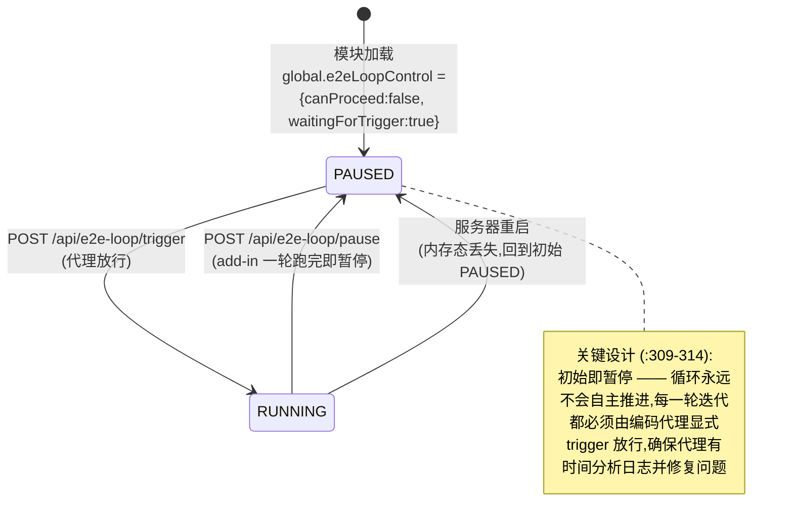
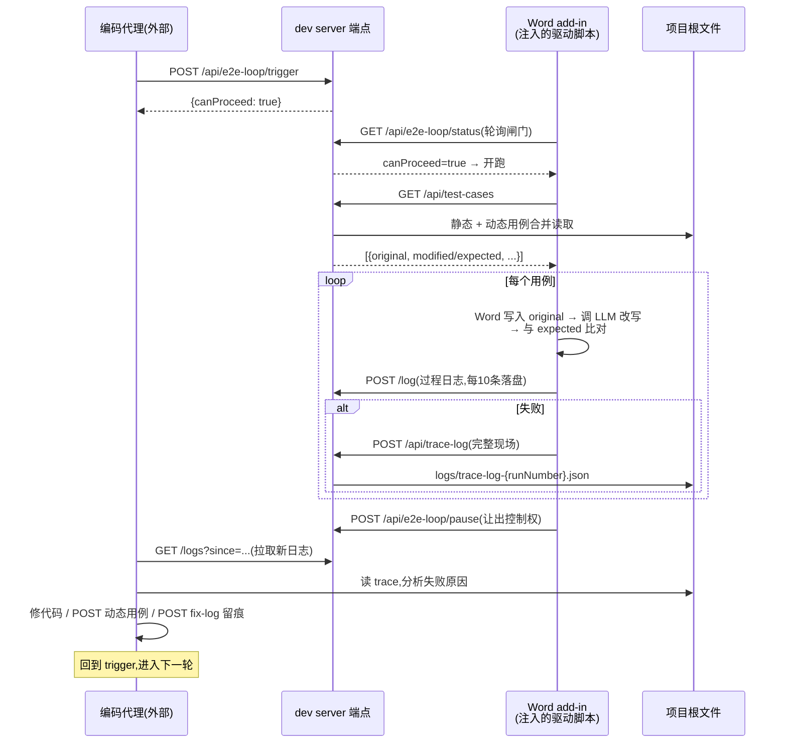

# Claric — Harness 执行逻辑分析报告

**日期:** 2026-09-05(v1.1 修订;初版 2026-09-04)
**范围:** 本仓库全部 harness 执行逻辑 — E2E/编码代理 harness(dev 端点)、Jest 单元测试 harness、CI/verify 门禁链、部署侧载链
**方法:** 静态阅读源码与配置 + git 历史考古(初始提交 `a9c9bed` → 当前)+ 两轮 `npx jest` 实测(2026-09-04 提交基线、2026-09-05 含未提交工作树)
**相关文档:** `docs/codebase-analysis-report.md`(2026-08-25 静态全库审查,其中 A1/S1/S4/T4 直接涉及本报告主题)
**v1.1 修订内容:** 纳入 `dc14258`(构建指纹,新增 §4.3)、`a5bb4de`(taskpane 入口预算 540 KiB)、`.zcode/` 代理工作区(§2.9)、2026-09-05 实测数据(§3.4);`webpack.config.cjs` 全部行号按新文件重校

---

## 1. 结论摘要(TL;DR)

"harness" 在 Claric 中指**三套彼此独立但目标一致的执行体系**,而非单一组件:

| # | Harness | 核心入口 | 状态 |
|---|---------|----------|------|
| 1 | **E2E / 编码代理 harness**(核心) | `scripts/dev-e2e-middlewares.cjs` + `webpack.config.cjs:498-503` 门控 | 可用但**休眠**:默认关闭,静态用例文件缺失,客户端(驱动脚本)不在本仓库 |
| 2 | **Jest 单元测试 harness** | `jest.config.cjs` + `babel.config.json` + `scripts/check-coverage.cjs` | **健康**:提交基线 69 套件 / 1763 用例全绿(2026-09-04);`dc14258` 后 70 套件 / 1777 用例(§3.4);三组覆盖率门禁生效 |
| 3 | **CI / verify 验证 harness** | `package.json:24`(verify 链)+ `.github/workflows/ci.yml` | 健康:本地与 CI 同构,含审计、类型检查、构建、镜像扫描 |

E2E harness 的本质是一组**挂在 webpack-dev-server 上的本地 HTTP 端点**,充当外部自主编码代理(如 `.codeartsdoer/` 工作区对应的 agent)与 Word 桌面端被测 add-in 之间的**数据总线与循环闸门**。它经历了三个演进阶段(内嵌 → 抽取加门控 → 路径穿越修复),当前主要风险不是漏洞,而是**协议的"另一半"(客户端驱动脚本)不在仓库内、静态用例从未入库、且未接入 CI**——与既有报告 T4 的判断一致。

---

## 2. E2E / 编码代理 harness(核心)

### 2.1 角色拓扑

```
┌──────────────────┐  HTTP(JSON, ACAO:*)   ┌─────────────────────────┐
│  外部编码代理      │ ─────────────────────▶ │  webpack-dev-server      │
│  (.codeartsdoer/  │   GET /logs            │  (ENABLE_DEV_ENDPOINTS  │
│   agent 工作区)    │   POST /api/e2e-loop/  │   =true 时)             │
│                   │     trigger | pause    │                         │
│  · 分析日志        │ ◀───────────────────── │  scripts/               │
│  · 修代码          │   GET /api/e2e-loop/   │  dev-e2e-middlewares.cjs│
│  · 造动态用例      │      status            │  = 13 个端点 + 文件 IO   │
└────────┬─────────┘                        └───────────┬─────────────┘
         │ 触发迭代 / 消费日志                            │ 持久化/读取
         ▼                                              ▼
┌──────────────────┐  HTTP(fetch, ACAO:*)   ┌─────────────────────────┐
│  Word 桌面端       │ ─────────────────────▶ │  项目根目录文件(数据总线) │
│  add-in(被测对象) │   POST /log            │  · logs/e2e-test-logs.json│
│  taskpane WebView │   POST /api/trace-log  │  · logs/fix-logs.json     │
│  (harness 注入的   │   POST /api/fix-log    │  · logs/trace-log-{n}.json│
│   驱动脚本执行)    │   GET  /api/test-cases │  · e2e-test-cases*.json   │
│                   │   GET  /api/prompts    │  · prompts.json           │
│                   │   GET  /api/e2e-loop/  │  · user-prompts.json      │
│                   │      status(闸门)      │  (后两者 gitignored)      │
└──────────────────┘                        └─────────────────────────┘
```

关键事实:**本仓库(`src/`、`scripts/`、`tests/`)没有任何消费这些端点的客户端代码**(全库检索 `e2e-loop`、`api/test-cases`、`api/trace-log` 等均为零命中)。端点注释("Receive logs from Word add-in"、"harness posts from the add-in origin")表明驱动脚本运行在 add-in 的 WebView 上下文中,由外部 harness 在测试时注入。仓库内只实现了协议的 **server 半边**。

### 2.2 注册链路与启用条件

启用路径是一条严格的三级门控(`webpack.config.cjs:498-503`):

```js
setupMiddlewares: process.env.ENABLE_DEV_ENDPOINTS === 'true'
  ? require('./scripts/dev-e2e-middlewares.cjs')
  : undefined,
```

1. **环境变量开关** — `ENABLE_DEV_ENDPOINTS` 不为字符串 `'true'` 时整个模块不加载,生产构建与 `scripts/docker-server.cjs`(生产服务器)永不包含这些端点(`dev-e2e-middlewares.cjs:7-8`)。
2. **默认回环绑定** — dev server 默认 `127.0.0.1`(`webpack.config.cjs:155`),`parseAllowedHosts` 显式拒绝 `'all'`(`webpack.config.cjs:26-32`),外机无法触达。
3. **函数签名钩子** — 导出的 `setupDevE2eMiddlewares(middlewares, devServer)` 符合 webpack-dev-server v5 的 `setupMiddlewares` 钩子约定;`devServer` 缺失即抛错(`:32-35`),随后取 `devServer.app` 直接挂 express 路由。

模块加载时即刻完成四件初始化(`:37-58`、`:231-250`):

- 为 5 个路由前缀挂 `express.json()` 请求体解析:`/api/prompts`、`/log`、`/api/test-cases`、`/api/trace-log`、`/api/fix-log`(`:41-45`);
- 确保 `logs/` 目录存在(`:56-58`);
- 从 `logs/e2e-test-logs.json` 预加载既有日志到内存并暴露为 `global.e2eLogs`(供外部脚本读取,`:61-75`);文件损坏则降级为空数组(`:70-73`);
- 加载(或创建为 `[]`)`logs/fix-logs.json`(`:231-250`)。

### 2.3 端点执行逻辑详解

共 13 个路由,分六组。所有端点均手工设置 `Access-Control-Allow-Origin: *`(有意为之,因为驱动脚本从 add-in origin 发请求;这也是模块必须门控的原因,`:10-15`)。

#### A. E2E 日志通道(内存环形 + 分批落盘)

| 路由 | 行号 | 执行逻辑 |
|------|------|----------|
| `POST /log` | `:92-115` | 取任意 JSON body → 打上 `receivedAt` 时间戳 → push 进内存 `logs` → 消息回显控制台 → **每累计 10 条**(`LOG_WRITE_INTERVAL`,`:88-89`)全量重写日志文件 → 200 |
| `OPTIONS /log` | `:121-126` | CORS 预检,204 |
| `GET /logs` | `:129-138` | 代理消费端:支持 `?since=<ISO>`(按条目 `timestamp` 字段过滤),默认返回**最近 1000 条** |
| `POST /logs/clear` | `:141-152` | 双清:内存 `logs.length = 0` + 文件重写为 `[]` |

#### B. Trace 日志(失败现场快照,Record & Replay)

| 路由 | 行号 | 执行逻辑 |
|------|------|----------|
| `POST /api/trace-log` | `:159-216` | 接收 `{testRunNumber, testId, originalText, expectedText, finalText, trace[]}` → **先校验 `testRunNumber` 为纯数字**(`/^\d+$/`,`:168`)→ 写 `logs/trace-log-{n}.json`;非法返回 400,写失败返回 500 |

trace 内容注释(`:188-195`)揭示了回放用途:`originalText` 用于测试环境重建,`expectedText` 用于核对,`finalText` 是 Word 文档终态,`trace[]` 记录精确到 API 调用级的执行轨迹——即一次"稳定性循环失败"的完整现场,供代理离线复现。

#### C. Fix 日志(代理的修复动作留痕)

| 路由 | 行号 | 执行逻辑 |
|------|------|----------|
| `POST /api/fix-log` | `:262-280` | 接收修复条目 + `receivedAt` → **立即持久化**(与 /log 的 10 条批处理不同,注释明言"fix logs are important")→ 返回累计 `totalFixes`;控制台回显 `metadata.file` 与 `metadata.issue` 前 50 字符 |

#### D. 循环闸门(状态机,详见 2.4)

| 路由 | 行号 | 执行逻辑 |
|------|------|----------|
| `GET /api/e2e-loop/status` | `:326-342` | 返回 `{canProceed, waitingForTrigger, lastIteration}`;`isWaiting = !canProceed \|\| waitingForTrigger`(`:335`)——**或语义**保证任何旧状态都报告"等待中",覆盖"pause() 调用时 server 不可达"的时序漏洞 |
| `POST /api/e2e-loop/trigger` | `:345-357` | `canProceed = true; waitingForTrigger = false` ——放行下一次迭代 |
| `POST /api/e2e-loop/pause` | `:360-372` | 反向复位,回到等待态 |

#### E. 测试用例 CRUD(静态 + 动态双层)

| 路由 | 行号 | 执行逻辑 |
|------|------|----------|
| `GET /api/test-cases` | `:379-409` | 读根目录 `e2e-test-cases.json`(静态层)+ `e2e-test-cases-dynamic.json`(动态层),拼接返回;两文件均 `existsSync` 保护,缺省即空 |
| `POST /api/test-cases` | `:412-453` | 校验必填 `original` + `modified` → 生成 `id: test-{Date.now()}-{rand36}` → **`expected` 是 `modified` 的别名**(说明用例语义:原文 → 期望改写后文)→ `reason` 缺省 `'auto-generated'` → 追加写动态文件 |

#### F. 提示词 CRUD(默认层只读覆盖语义)

| 路由 | 行号 | 执行逻辑 |
|------|------|----------|
| `GET /api/prompts` | `:458-490` | 读 `prompts.json`(默认库,git 追踪,初始提交即有)+ `user-prompts.json`(用户层,gitignored),**按 id 用 Map 覆盖合并**(用户层胜出) |
| `POST /api/prompts` | `:493-531` | upsert:必填 `{id, name, template}`,存在同 id 则更新否则追加,写 `user-prompts.json` |
| `DELETE /api/prompts/:id` | `:534-566` | **只能删用户层**;若过滤后长度不变(即目标是默认提示词)返回 404——以"查无此条"的方式保护默认库只读 |

### 2.4 循环闸门状态机



设计意图写在源码注释里(`:308-314`):*"CRITICAL: Initial state is PAUSED - loop will only proceed when explicitly triggered. This ensures the coding agent has time to analyze logs and fix issues before each iteration."* 这使整个 E2E 循环成为**代理驱动的半自动节拍器**,而非无人值守的 CI 轮询。

### 2.5 稳定性循环(Stability Loop)端到端时序

由 trace-log 端点注释(`:158`)与数据结构反推的完整迭代流程:



配套证据:`POST /api/test-cases` 的 `reason` 缺省值 `'auto-generated'`(`:437`)表明动态用例正是代理在修复过程中自动构造的回归用例;`global.e2eLogs` 暴露(`:75`)则是为外部 Node 脚本直读服务内存而留的接口。

### 2.6 持久化模型与关闭钩子

| 数据 | 写入时机 | 崩溃丢失窗口 |
|------|----------|--------------|
| e2e 日志 | 每 10 条批处理 + 关闭时(`:104-109`, `:293-299`) | 最多 9 条 |
| fix 日志 | 每条立即(`:268`)+ 关闭时 | 0 |
| trace | 即时单文件 | 0 |
| 动态用例 / 用户提示词 | 每次写操作即全量重写 | 0 |

关闭钩子用 `process.once('SIGINT'/'SIGTERM')` 注册(`:301-302`),持久化两类日志后 `process.exit(0)`(`:293-299`)。`once` 而非 `on` 是有意的:模块可能被多次 setup(热重载),`once` 防止处理器叠加,同时**不清除**其他模块安装的同名信号处理器(`:17-18` 注释明确此为对旧实现 `removeAllListeners` 的修正)。

### 2.7 安全设计与硬化历史

当前防护层:

1. **默认关闭**(`ENABLE_DEV_ENDPOINTS` 门控)+ **回环绑定**(`127.0.0.1` 默认)+ **host 白名单拒绝 `'all'`**;
2. 生产侧零暴露:`docker-server.cjs` 不含任何此类端点;
3. **路径穿越修复**:`/api/trace-log` 曾把请求体里的 `testRunNumber` 直接插值进文件名,配合 ACAO:* 可被任意本地页面在 `logs/` 外写任意 `*.json`(`a2df0e1` 修复,现为纯数字校验 `:163-175`);
4. LLM 代理目标校验 `parseProxyTarget` 只允许 HTTPS 或回环/`host.docker.internal` 的 HTTP(`webpack.config.cjs:121-162`),TLS 默认校验(`:267`)。

残余暴露面(详见 §7 R3):dev-e2e 各端点的 `ACAO: *` 是**硬编码**的,不经过 `webpack.config.cjs:108-119` 的 origin 白名单解析——当端点启用且 dev server 运行时,本机任意浏览器页面均可向其 POST 写文件。这是"开发便利 vs 攻击面"的已知权衡,由文档(`SECURITY.md:43-48`、`README.md:632`、`.env.example:38-41`)三处明示。

### 2.8 演进史(git 考古)

| 提交 | 日期 | harness 相关变化 |
|------|------|------------------|
| `a9c9bed`(初始) | — | ~520 行端点逻辑**内嵌**于 `webpack.config.cjs` 的 `setupMiddlewares`;`allowedHosts: 'all'`;全局静态 `ACAO:*` 头;代理 `secure: false`;`process.removeAllListeners` + `process.on`(会清掉他人处理器) |
| `4bf922a` | 2026-08-26 | 落实审查报告 P0:**抽取**为 `scripts/dev-e2e-middlewares.cjs`;新增 `ENABLE_DEV_ENDPOINTS` 门控(默认关);dev server 默认绑 `127.0.0.1`;`parseAllowedHosts` 拒绝 `'all'`;代理 TLS 默认校验;信号处理改 `process.once`。**同日** `logs/e2e-test-logs.json` 留下仅有的两条 `"smoke"` 记录 |
| `a2df0e1` | 2026-08-29 | 修复 trace-log 路径穿越(`testRunNumber` 数字校验) |
| (现状,2026-09-05) | — | 端点模块自 `a2df0e1` 后未再变动;`webpack.config.cjs` 其后的改动均为构建指纹方向(`dc14258`,§4.3),harness 表面不变。`docs/codebase-analysis-report.md` T4/A1/§7-Q1 持续追问:harness 是否仍在用?未接 CI——接线或删除 |

### 2.9 当前状态盘点

| 资产 | 状态 | 说明 |
|------|------|------|
| `prompts.json`(默认提示词库) | 存在,git 追踪 | 初始提交即有;**未被 src/ 任何代码消费**,纯 harness 数据(如 `legal-review` 法律条款改写模板) |
| `e2e-test-cases.json`(静态用例) | **不存在** | GET 返回 `[]`;从未入库或已被清理;注意它**不在** `.gitignore` 中 |
| `e2e-test-cases-dynamic.json` | 不存在 | gitignored(`.gitignore:50`),代理运行时生成 |
| `user-prompts.json` | 不存在 | gitignored(`.gitignore:49`) |
| `logs/e2e-test-logs.json` | 2 条 `"smoke"`(2026-08-26) | gitignored;与 `4bf922a` 硬化同日——硬化后做过连通性冒烟 |
| `logs/fix-logs.json` | `[]` | 尚无修复留痕 |
| `logs/trace-log-*.json` | 无 | 无失败现场留存 |
| `.codeartsdoer/` 工作区 | 存在 | 编码代理配置(`AGENTS.md` 工程上下文、`mcp/mcp_settings.json`、`@opencode-ai/plugin` 依赖)——外部执行端的存在性证据 |
| `.zcode/` 工作区(v1.1 新增) | 存在(untracked) | 第二个编码代理工作区;`plans/plan-sess_*.md` 是驱动 `dc14258`(构建指纹)的完整实施方案文档(含字段定义、hash 计算策略、插入位置)——"代理规划 → 落码 → 提交"全链路在仓库内留痕的直接证据 |

---

## 3. Jest 单元测试 harness

### 3.1 执行链

`npm test` → jest 30 → 按文件逐个:`babel-jest` 转译(`babel.config.json` 仅一条:`@babel/preset-env` targets `node: current`,即把 ESM 源码转成 specs 里 `require()` 可用的 CJS)→ 在默认 **node** 环境执行。

`jest.config.cjs` 的关键决策:

| 配置 | 值 | 理由(源码注释) |
|------|-----|------|
| `testEnvironment` | `'node'`(`:5`) | 默认无 DOM;需要 DOM 的套件自行声明(见 3.2) |
| `transformIgnorePatterns` | `node_modules/(?!marked/)`(`:9-11`) | `marked` 17 是 ESM-only,必须转译才能被 CJS 加载 |
| `moduleNameMapper` | `\.css$ → tests/__mocks__/styleMock.js`(`:12-16`) | `taskpane.js` 为 webpack `import './taskpane.css'`,Jest 下会崩,统一 stub 为 `{}` |
| `testMatch` | `tests/**/*.spec.js`(`:18`) | 当前 **70 个** spec 文件(`dc14258` 新增 `build-info.spec.js`) |
| `collectCoverageFrom` | `src/**/*.js`,排除 `src/lib/vendor/` 与 `src/scripts/`(`:19-33`) | 覆盖率统计范围 = 全 src(此前只收 `src/lib`,系审查报告 T1 修复项) |
| `coverageThreshold` | **有意缺失**(`:34-41`) | jest 内建阈值会把 ignore 的 vendored 文件按 0% 重新计入,压低全局约 15 分;门禁外移到 `check-coverage.cjs` |
| 其他 | `moduleFileExtensions: ['js']`、`coverageDirectory: 'coverage'`、`verbose: true` | — |

### 3.2 DOM 环境策略(双层)

- **docblock 声明**:12 个 spec 在文件头用 `@jest-environment jsdom` 切环境(注:`jest.config.cjs:1-3` 头注释写的"6 specs"已过时);
- **手工 JSDOM**:6 个 spec 在套件内 `new JSDOM(...)` 精确构造 DOM 片段。

### 3.3 Mock 体系与编写范式

仓库不依赖 `jest.mock` 大范围自动 mock,而是三种手工范式:

1. **依赖注入 seam**:核心模块(如 `createConversation`)把 Word API 与 LLM 客户端作为参数注入,测试传纯 JS 替身——这是"lib 层无 DOM/Word 依赖"架构的直接红利(既有报告 §6 亦列为优点);
2. **套件内工厂函数**:如 `tests/orchestrator.spec.js:18-70` 的 `mockChunk` / `mockPromptManager` / `mockSendMessages`(可编程延迟、按 chunk 下标失败、并发追踪)。spec 头部普遍带 `ORCH-01` 式用例编号,注释即规格;
3. **构建物契约测试**(`dc14258` 新增):`tests/build-info.spec.js` 不 mock 任何东西,而是对磁盘上真实的 `dist/build-info.json` 断言结构事实(12 位 hex hash、ISO-8601 时间、`appVersion` 镜像 `package.json`);`dist/` 被 gitignore,文件缺失时以 `describe.skip` 优雅跳过,保证未构建的新 checkout 套件仍全绿——代价是未构建环境下该契约不受验证。

覆盖率门禁见 3.5。

### 3.4 实测当前状态

**提交基线(2026-09-04,HEAD = `a5bb4de`):**

```
Test Suites: 69 passed, 69 total
Tests:       1763 passed, 1763 total
Time:        1.959 s
```

**`dc14258` 之后(2026-09-05,含未提交工作树):**

```
Test Suites: 70 total
Tests:       1777 total(1754 passed)
Time:        1.782 s
```

`dc14258` 新增 `build-info.spec.js`(套件 69 → 70);工作树另有 10 个文件的图像/图注功能开发正在进行,按仓库 TDD 惯例先行落 spec、实现收尾中,属正常开发中间态,与 harness 无关——提交基线始终全绿。

### 3.5 覆盖率门禁 harness(`scripts/check-coverage.cjs`)

在 `npm run coverage`(jest `--coverage` + json-summary)之后运行,读取 `coverage/coverage-summary.json`,按**三个独立分组**重算聚合(不是读 jest 的 total),任一指标不达标即逐条列出并 exit 1(`:74-88`):

| 分组 | statements | branches | functions | lines | 定位 |
|------|-----------|----------|-----------|-------|------|
| global | 70 | 65 | 70 | 72 | 兜底 |
| `src/lib/` | 88 | 80 | 93 | 91 | 纯逻辑层,纪律最好 |
| `src/taskpane/` | 56 | 51 | 54 | 56 | 贴着实测基线(57.2/52.8/55.6/57.7)留噪声余量,专防 UI 层退化 |

两个值得注意的设计(`:21-26`, `:42-48`):

- **分组门禁是有意为之**:若只有 global + src/lib,占大头的 src/lib(~90%)会把 global 托在 70 以上,src/taskpane 跌到 ~50% CI 依然绿——"门禁最严的地方恰是本来就最好的地方,最需要的地方反而没有";
- **ratchet(棘轮)策略**:门禁只许上调不许下调,注释点名当前最大缺口 `settings-view.js`(733 statements, 0%)与 `status-bar.js`(97 statements, 22%);
- 另有防御:分组匹配到 0 个文件时直接失败(`:70-73`),防止 summary 文件缺失时静默通过。

---

## 4. CI / verify 验证 harness

### 4.1 本地链(`package.json:24`)

```
npm run verify = lint → test → coverage → check-coverage → typecheck → build
```

`typecheck` 为 `tsc`(tsconfig checkJs 覆盖 src/lib,`4bf922a` 引入);`build` 前先跑 `generate-icons.cjs`。CLAUDE.md:13 声明该链与 CI 等价。

### 4.2 CI 流水线(`.github/workflows/ci.yml`)

```
push(main / v*tag) / PR
 └─ concurrency 组按 ref 取消旧跑
 ├─ job: verify (node 22)
 │   npm ci
 │   npm audit --omit=dev --audit-level=high   ← 生产依赖漏洞门禁 (:32-33)
 │   npm run lint
 │   npm test
 │   npm run coverage && npm run check-coverage ← 覆盖率门禁 (:41-44)
 │   npm run typecheck
 │   npm run build                              ← 性能预算硬门禁(hints:'error',taskpane 入口 540 KiB,`a5bb4de`)
 └─ job: docker (needs: verify)
     docker build -t claric:ci
     trivy 扫描 CRITICAL/HIGH,exit-code=1       ← 镜像门禁 (:65-73)
     仅 v* tag:登录 GHCR → 推送 {tag, latest}   (:75-94,GHCR 小写化处理)
```

要点:两条 job 串联形成"代码门禁 → 镜像门禁"两级;E2E harness **不在**此链中(T4)。

### 4.3 构建指纹 harness(v1.1 新增;`dc14258`,2026-09-04)

生产构建现在自带内容指纹机制,三部分协作:

1. **内联 webpack 插件 `claric-build-info`**(`webpack.config.cjs:436-486`,`compiler.hooks.done.tap`):仅在 production 模式触发(dev-server 重建不搅动产物)。递归遍历 `dist/`,对每个文件字节算 SHA-256,按 `relpath:sha256` 排序串接后再哈希,取前 12 位十六进制写入 `dist/build-info.json`:

   ```json
   { "hash": "<12-hex>", "builtAt": "<ISO-8601 UTC>", "mode": "production", "appVersion": "<package.json version>" }
   ```

   设计点:hash 只依赖文件内容、与 mtime/atime 无关 → 本地与 CI 结果可复现;`appVersion` 直接读 `package.json`,与 manifest `<Version>` 保持同源同步。
2. **taskpane 启动自报**(`src/taskpane/taskpane.js:210-225`):fire-and-forget `fetch('build-info.json', { cache: 'no-store' })`,在 Activity 日志写一行 `Claric build: <hash> (<appVersion>, <builtAt>)`;任何失败(4xx/5xx、解析错误、字段缺失)一律静默——缺指纹绝不打扰用户,只进日志抽屉。
3. **构建物契约测试**(`tests/build-info.spec.js`):断言 schema 与 `appVersion` 镜像关系;文件缺失时跳过(见 §3.3 范式 3)。

与 E2E harness 的衔接:Activity 日志里的构建指纹让"某次会话跑的是哪个构建"可肉眼核对;若 E2E 驱动脚本将来把该日志行经 `POST /log` 上报,代理即可把失败 trace 归因到精确构建——当前驱动脚本不在仓库(§2.1),此协同属预留能力。

---

## 5. 部署侧载链(简述)

|harness 环节 | 实现 | 执行逻辑 |
|---|---|---|
| manifest 生成 | `scripts/generate-manifest.cjs` | 模板 + `.env` → `manifest.xml`(稳定 GUID 持久化于 `.manifest-guid`、版本同步、XML 转义) |
| 模式切换 | `scripts/manifest-mode.cjs` | `local` / `store` 两套端点指向 |
| 侧载安装 | `scripts/sideload-addin.cjs` | 前置校验 `manifest.xml` 存在(`:29-32`)→ 按平台分派:win32 → `powershell Install/Uninstall-Claric.ps1`(写 `HKCU:\...\Wef\Developer` 注册表,`:63-81`);darwin → `bash Install-Claric.sh`(拷入 Word `wef/` 容器 + 生成启动文档,`:83-100`);其余平台打印 Word on web 手动路径。`--remove` 反安装;幂等;失败时打印手动回退指引 |
| 发布 | `scripts/publish-addin.cjs` | add-in 上架流程(118 行) |

此链是 E2E harness 的**前置环节**——代理必须先侧载才能让 Word 加载被测 add-in。

---

## 6. 发现的问题与风险

| # | 严重度 | 发现 | 证据 |
|---|--------|------|------|
| R1 | **中** | 协议只有 server 半边在仓库内:E2E 驱动脚本(客户端)不在任何 tracked 文件中,完整 E2E 能力依赖外部 harness 环境,仓库自描述不完整 | `src/` 全库零引用端点;`dev-e2e-middlewares.cjs:5` 仅称 "external harness" |
| R2 | **中** | 静态用例层空转:`e2e-test-cases.json` 不存在,`GET /api/test-cases` 恒返回动态层(当前也为空)——harness 若此时启动,循环无事可做 | §2.9 盘点 |
| R3 | 低 | 端点 CORS 硬编码 `ACAO:*`,不经 origin 白名单;端点启用期间本机任意页面可写 `logs/`、`user-prompts.json`、动态用例文件(trace-log 一处已修,其余写端点无 Origin/token 校验) | `:111-114` 等逐端点头 vs `webpack.config.cjs:108-119` 白名单机制 |
| R4 | 低 | `POST /log` 每 10 条**全量重写**整个 JSON 文件,日志量大时 IO 为 O(n²);且进程被 SIGKILL 时批处理缓冲丢失 | `:78-85`, `:104-109` |
| R5 | 低 | 信号处理器内 `process.exit(0)`(`:298`)绕过 dev server 自身的优雅关闭路径 | `:293-299` |
| R6 | 信息 | `GET /logs` 默认截取最近 1000 条,代理若不用 `since` 参数可能漏读早期日志 | `:129-138` |
| R7 | 信息 | `jest.config.cjs:1-3` 头注释的 jsdom 计数过时(称 6 + 3,实测 12 docblock + 6 手工 JSDOM) | 本报告 §3.2 |
| R8 | 信息 | E2E harness 未接入 CI(沿袭既有报告 T4/A1 的判断,本报告未发现状态变化) | `ci.yml` 无 E2E 步骤 |

## 7. 建议

1. **先回答既有报告 §7-Q1 的悬而未决问题**——harness 是否仍在服役。两条路二选一:
   - **保留**:① 把客户端驱动脚本收编入仓(如 `scripts/e2e-driver.js`),让协议自洽(R1);② 将静态用例 `e2e-test-cases.json` 脱敏入库(R2);③ 为 `dev-e2e-middlewares.cjs` 补一套 supertest 冒烟 spec——当前该 571 行模块测试覆盖为 0;④ 给写端点加 Origin 校验或一次性 token(R3);⑤ 落一份端点协议文档。
   - **删除**:直接移除 `scripts/dev-e2e-middlewares.cjs` + `webpack.config.cjs:498-503` 门控,一次性消解 R1/R3/R4/R5/R8 与既有报告的 A1/S1/T4。
2. **低成本止血**(若暂不决策):R4 可改为 append + 定期压缩;R5 把 `exit(0)` 换成仅持久化、让默认信号行为接管。
3. **Jest harness 微修**:更新 `jest.config.cjs` 头注释计数(R7);随 taskpane 层测试补齐按棘轮上调 `check-coverage.cjs` 的 src/taskpane 门禁。

---

## 附录:本报告引用的关键位置

| 文件 | 位置 | 内容 |
|------|------|------|
| `webpack.config.cjs` | `:498-503` | ENABLE_DEV_ENDPOINTS 门控注册 |
| | `:155`, `:26-32` | 回环默认绑定 / host 白名单 |
| | `:121-162`, `:222-329` | 代理目标校验 / LLM 代理构建 |
| | `:436-486`(v1.1) | `claric-build-info` 构建指纹插件(production-only) |
| `src/taskpane/taskpane.js` | `:210-225`(v1.1) | 启动读取 build-info 并写 Activity 日志(静默失败) |
| `tests/build-info.spec.js`(v1.1) | 全文 | 构建物契约测试,`dist/build-info.json` 缺失即 skip |
| `scripts/dev-e2e-middlewares.cjs` | `:41-45`, `:61-75`, `:87-89` | body 解析 / 日志预加载+global 暴露 / 批量落盘节拍 |
| | `:92-152` | /log、/logs、/logs/clear |
| | `:159-216` | /api/trace-log(含 `:168` 穿越校验) |
| | `:231-302` | fix-log 与关闭持久化 |
| | `:308-372` | 循环闸门状态机 |
| | `:379-453` | 测试用例 CRUD |
| | `:458-566` | 提示词 CRUD |
| `jest.config.cjs` | 全文 | 单测 harness 配置与理由 |
| `scripts/check-coverage.cjs` | `:30-50`, `:70-88` | 三组门禁 / 零文件与失败处理 |
| `.github/workflows/ci.yml` | `:32-50`, `:65-94` | verify 步骤 / docker+trivy+GHCR |
| `scripts/sideload-addin.cjs` | `:63-100` | 平台分派安装 |
| `package.json` | `:24` | verify 链 |
| `.zcode/plans/plan-sess_*.md`(v1.1) | 全文 | 编码代理驱动 `dc14258` 的实施方案(规划留痕) |
| git | `a9c9bed` → `4bf922a` → `a2df0e1` | E2E harness 三阶段演进 |
| | `a5bb4de` → `dc14258`(v1.1) | 构建预算 540 KiB → 构建指纹(§4.3) |
